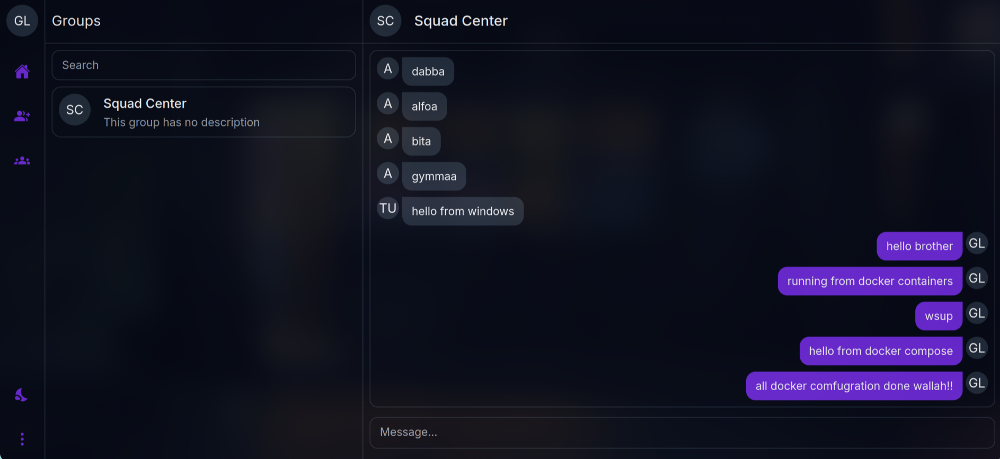

# Chatly: A Real-Time Chat Application

## Overview

Chatly is a real-time chat application built with a modern tech stack, including **Rust**, **React**, **Docker**, and **Vercel**. The app allows users to join groups, send messages, and interact with others in a sleek, dark-themed UI.

- **Live Demo**: [Chatly App](https://chatly-react-rust.vercel.app/)
- **Repository**: [GitHub](https://github.com/lohargaurav00/chatly-rust-react)

## Features

- **Group-based Chat**: Join and interact in specific groups.
- **Real-Time Communication**: Experience seamless real-time messaging.
- **Responsive Design**: Built for a consistent experience on desktop and mobile.
- **Dockerized Setup**: Run the application effortlessly using Docker and Docker Compose.

## Tech Stack

### Frontend

- **React.js**
- **Zustand**: For state management
- **Tailwind CSS**: For styling
- **NextAuth**: For authentication

### Backend

- **Rust**: Powered by Actix-web for high-performance backend services
- **PostgreSQL**: For database management
- **WebSocket Support**: Using Actix-Socket for real-time communication
- **SQLx**: For interacting with PostgreSQL in an asynchronous and type-safe manner

### DevOps

- **Docker & Docker Compose**: For containerized development and deployment
- **Deployment**: Frontend on **Vercel** and backend on **Render**
